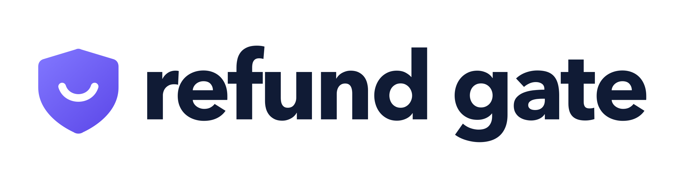
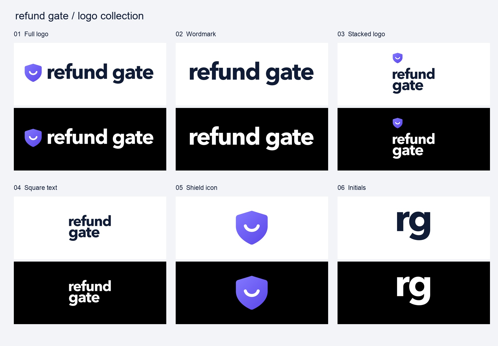

# Refund Gate logo kit

The selected Refund Gate identity: a violet shield and smile beside the lowercase wordmark.

[Download the complete organized logo kit](refund-gate-logo-kit.zip)

## Layouts

| Layout | SVG for light backgrounds | SVG for dark backgrounds | PNG |
|---|---|---|---|
| Full logo | [SVG](refund-gate-horizontal-transparent-light.svg) | [SVG](refund-gate-horizontal-transparent-dark.svg) | [PNG](refund-gate-horizontal-white.png) |
| Wordmark | [SVG](refund-gate-wordmark-transparent-light.svg) | [SVG](refund-gate-wordmark-transparent-dark.svg) | [PNG](refund-gate-wordmark-white.png) |
| Stacked logo | [SVG](refund-gate-square-stacked-transparent-light.svg) | [SVG](refund-gate-square-stacked-transparent-dark.svg) | [PNG](refund-gate-square-stacked-white.png) |
| Square text | [SVG](refund-gate-square-text-transparent-light.svg) | [SVG](refund-gate-square-text-transparent-dark.svg) | [PNG](refund-gate-square-text-white.png) |
| Shield icon | [SVG](refund-gate-icon-transparent-light.svg) | [SVG](refund-gate-icon-transparent-dark.svg) | [PNG](refund-gate-icon-white.png) |
| Initials | [SVG](refund-gate-square-rg-transparent-light.svg) | [SVG](refund-gate-square-rg-transparent-dark.svg) | [PNG](refund-gate-square-rg-white.png) |

## Variations

Each layout includes white and black backgrounds, transparent versions for light and dark surfaces, and monochrome black and white versions. SVG and PNG are supplied for all six treatments; JPEG is supplied for white and black backgrounds.

Individual assets are stored here with descriptive filenames. The ZIP preserves the original folder structure. Download `logo-guide.html` with the individual files to view the color and spacing guide locally, or unzip the complete kit and open its guide.

## Colors

- Navy: `#101B35`
- Violet gradient: `#8278FF` to `#5B46E8`
- White: `#FFFFFF`
- Black: `#000000`

SVG lettering is outlined, so font installation is not required. Native Adobe Illustrator files are not included; SVGs can be opened in Illustrator and saved as `.ai`.

